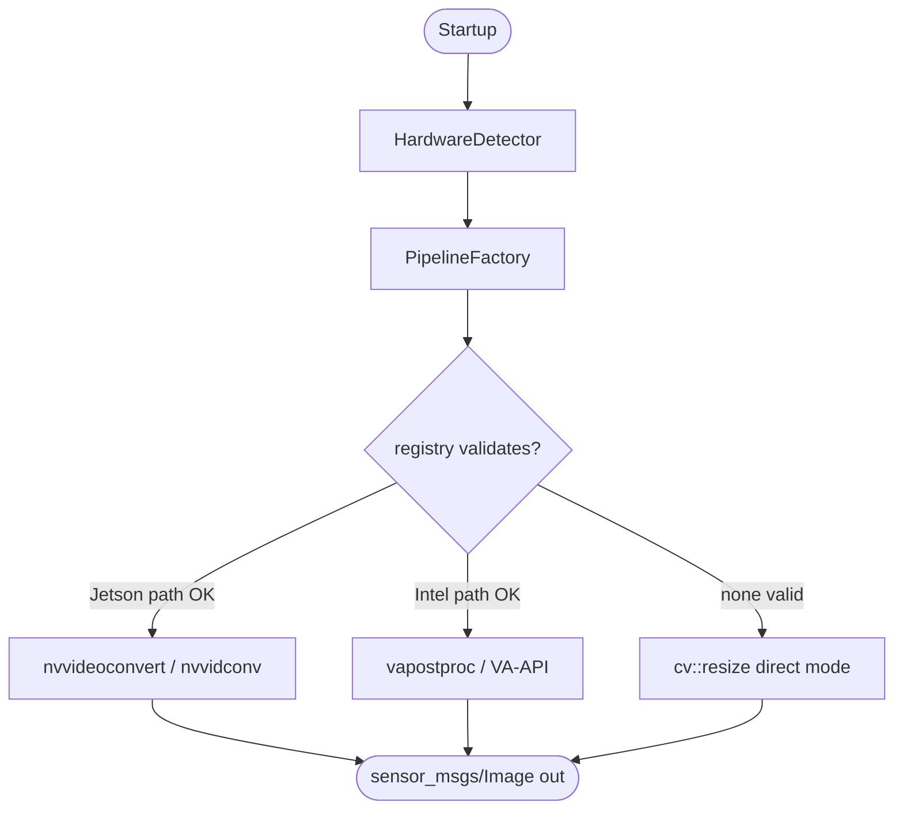

# Prism
*ROS 2 perception acceleration that picks the right path through your hardware.*

[](https://docs.ros.org/en/humble/)
[](LICENSE)
[](https://gstreamer.freedesktop.org/)
[](https://en.cppreference.com/w/cpp/17)

Hardware-agnostic ROS 2 image-processing accelerator. `prism::ResizeNode` is a **drop-in replacement for `image_proc::ResizeNode`'s resize pipeline** (one-line launch-file swap; same parameters, same `sensor_msgs/Image` output, scaled `CameraInfo` on the paired topic) that auto-detects host accelerators at runtime and selects the first validated backend (priority-ordered: Jetson NVMM → Intel VA-API → CPU): a GStreamer pipeline with **zero-copy intra-process ingest** on supported GPUs, or a direct `cv::resize` callback when no usable GPU path is present. Egress is a single copy; the claim is *zero-copy ingest, no DDS round-trip*, not end-to-end zero-copy. Input honours `image_transport` (default `raw`; compressed transports decode before GStreamer ingest).

[**Documentation & benchmarks →**](https://sohams25.github.io/prism-ros/)

---

## Positioning / Scope

**Segment definition.** Prism targets the segment of the ROS 2 fleet Isaac ROS does not cover: Intel iGPU, AMD, Rockchip RK3588 / Mali-G610, older Jetson, and Jetson Orin pinned to Humble. Listing the SoC class is the point. There is no claim of optimised RK3588 support; that path uses the `cv::resize` fallback today, the same as any non-NVIDIA host without VAAPI.

**Isaac ROS landscape.** Isaac ROS 4.0 (November 2025) pivoted to ROS 2 Jazzy on Jetson Thor, x86 Ampere-or-newer, and DGX Spark; the current branch `release-4.3` continues that line. Isaac ROS 3.2 is the last branch supporting Jetson Orin Nano/NX/AGX and Xavier on Humble. There is no non-NVIDIA support in any branch.

**REP-2007/2009 as architectural choice.** Prism does not implement REP-2007 type adaptation or REP-2009 type negotiation. Type adaptation couples the data path to one vendor's buffer types. Runtime backend selection with live GStreamer-registry validation is the alternative. The tradeoff is deliberate: hardware portability across Intel, AMD, RK3588, and Orin-on-Humble in exchange for giving up GPU-resident data flow between nodes.

## Quick start

### Prerequisites
ROS 2 Humble on Ubuntu 22.04. GStreamer 1.20+.

### Install
```bash
cd ~/ros2_ws/src
git clone https://github.com/sohams25/prism-ros.git prism_image_proc
sudo apt install \
  ros-humble-image-transport ros-humble-image-proc \
  libgstreamer1.0-dev libgstreamer-plugins-base1.0-dev \
  gstreamer1.0-plugins-base gstreamer1.0-plugins-good \
  gstreamer1.0-vaapi
cd ~/ros2_ws
colcon build --packages-select prism_image_proc
source install/setup.bash
```

### Run the demo
The demo launch file spins up a single `prism::ResizeNode` inside a component container, subscribed to `/camera/image_raw` and publishing to `/camera/image_processed`. You supply the image source — point a camera driver at `/camera/image_raw`, or run `prism::MediaStreamerNode` / `prism::Synthetic4kPubNode` in a second terminal.

```bash
ros2 launch prism_image_proc prism_image_proc_demo.launch.py
```

The resize node logs the selected backend (GPU or direct mode) and publishes processed 640×480 frames on `/camera/image_processed` with scaled `CameraInfo` on the paired topic.

For the full A/B stress test against `image_proc::ResizeNode`, see [A/B comparison launch](#ab-comparison-launch) below.

## Usage

### Drop-in replacement for image_proc::ResizeNode

```python
ComposableNode(
    package='prism_image_proc',           # was: 'image_proc'
    plugin='prism::ResizeNode',           # was: 'image_proc::ResizeNode'
    name='resize',
    parameters=[{'use_scale': False, 'width': 640, 'height': 480}],
)
```

Same resize parameters, same output topic, same `sensor_msgs/Image` on the output. Prism also publishes a scaled `CameraInfo` on the paired topic — check the `publish_camera_info` parameter.

### Action chaining

The chainable base — `prism::ImageProcNode` — accepts a comma- or pipe-separated action chain. Each action has per-backend GStreamer fragment builders (CPU / Intel VA-API / Jetson NVMM) and a corresponding CameraInfo transform so intrinsics track the image.

```python
ComposableNode(
    package='prism_image_proc',
    plugin='prism::ImageProcNode',
    name='preprocess',
    parameters=[{
        'action': 'crop,resize,colorconvert',
        'crop_x': 320, 'crop_y': 180,
        'crop_width': 1280, 'crop_height': 720,
        'width': 640, 'height': 360,
        'target_encoding': 'rgb8',
    }],
)
```

Supported actions: `resize`, `crop`, `flip`, `colorconvert`.

### A/B comparison launch

`launch/A_B_comparison.launch.py` runs `image_proc::ResizeNode` and `prism::ResizeNode` side-by-side in separate component containers over the same source video, for latency / CPU / RSS comparison.

```bash
ros2 launch prism_image_proc A_B_comparison.launch.py \
  video_path:=/path/to/4k_video.mp4
```

## Components

Registered ROS 2 components:

| Class | Purpose |
| --- | --- |
| `prism::ImageProcNode` | Chainable base. Configurable action chain; use directly when you need crop+resize+colorconvert composed. |
| `prism::ResizeNode` | Thin wrapper pinning `action="resize"`. **Drop-in replacement for `image_proc::ResizeNode`.** |
| `prism::CropNode` | Thin wrapper pinning `action="crop"`. |
| `prism::ColorConvertNode` | Thin wrapper pinning `action="colorconvert"`. Target `bgr8` / `rgb8` / `mono8`. |

Test / demo helpers:

| Class | Purpose |
| --- | --- |
| `prism::MediaStreamerNode` | Video-file publisher (used by the A/B launch). |
| `prism::Synthetic4kPubNode` | Synthetic 4K test source. |

Load any of the above into an `rclcpp_components::ComponentContainer` with `use_intra_process_comms: true` to get the zero-copy ingest path.

## Parameters

<details>
<summary>Expand full parameter reference</summary>

### Core resize

| Parameter | Type | Default | Description |
|---|---|---|---|
| `use_scale` | bool | `false` | Scale by factor instead of absolute size |
| `scale_width`, `scale_height` | double | `1.0` | Scale factors when `use_scale=true` |
| `width`, `height` | int | `640`, `480` | Output size when `use_scale=false` |
| `input_topic` | string | `/camera/image_raw` | Source topic |
| `output_topic` | string | `/camera/image_processed` | Destination topic |

### Action chain

| Parameter | Type | Default | Description |
|---|---|---|---|
| `action` | string | `resize` | Action chain, comma- or pipe-separated (e.g. `crop,resize,colorconvert`) |
| `target_encoding` | string | `bgr8` | Only read when chain contains `colorconvert`. One of `bgr8`, `rgb8`, `mono8` |
| `crop_x`, `crop_y`, `crop_width`, `crop_height` | int | `0` | Only read when chain contains `crop`. Pixel offsets into the source |
| `flip_method` | string | `none` | Only read when chain contains `flip`. `none`, `horizontal`, or `vertical` |

### Transport

| Parameter | Type | Default | Description |
|---|---|---|---|
| `input_transport` | string | `raw` | `image_transport` name (`raw`, `compressed`, `theora`, …). `raw` keeps the UniquePtr zero-copy hot path |
| `publish_camera_info` | bool | `true` | Publish a scaled `CameraInfo` alongside the processed image |
| `source_width`, `source_height` | int | `3840`, `2160` | Source caps (GPU mode only) |

### Media streamer parameters

`prism::MediaStreamerNode` — video-file publisher used by the A/B launch.

| Parameter | Type | Default | Description |
|---|---|---|---|
| `video_path` | string | `/tmp/test_video.mp4` | Input video file |
| `loop` | bool | `true` | Restart on EOF |
| `max_fps` | double | `10.0` | Publish rate cap |
| `image_topic` | string | `/camera/image_raw` | Image topic |
| `info_topic` | string | `/camera/camera_info` | CameraInfo topic |

</details>

## Architecture

At startup `HardwareDetector` probes `/dev` for accelerator devices, then queries the live GStreamer registry via `gst_element_factory_find` (the same C API that `gst-inspect` is built on) to confirm the matching elements load. The Jetson probe is two-step: prefer `nvvideoconvert`, fall back to the legacy `nvvidconv`. The Intel probe is two-step too: prefer `vapostproc`, fall back to `vaapipostproc`. `PipelineFactory` then builds a backend-specific pipeline fragment for each action in the chain, validates the complete pipeline live, and hands it to `ImageProcNode`. If no GPU element registers, the node falls back to a direct `cv::resize` in the subscriber callback — no GStreamer involvement at all.

<!-- Do NOT add %%{init: {'theme': ...}}%% — GitHub's native Mermaid
     renderer auto-adapts to dark/light mode only when no theme is
     forced. Forcing a theme breaks the opposite mode. -->


### Fallback chain

| Priority | Platform | Detection | Processing |
|---|---|---|---|
| 1 | NVIDIA Jetson | `/dev/nvhost-*`, `/dev/nvmap` | GStreamer `nvvideoconvert` (CUDA / NVMM); legacy `nvvidconv` accepted as second-step probe |
| 2 | Intel VA-API | `/dev/dri/renderD*` + `vapostproc` in registry | GStreamer `vapostproc` |
| 3 | CPU (always) | — | Direct `cv::resize` in callback |

The fallback is **live-validated** against the GStreamer plugin registry — an accelerator that's present but broken (for example, the `vaapipostproc` chroma bug on GStreamer 1.20) is skipped, not attempted.

## How it works

<details>
<summary>Expand internals</summary>

### Zero-copy ingest, single-copy egress
Input arrives via intra-process `UniquePtr` delivery (`raw` `image_transport`) or through an `image_transport::Subscriber` plugin for compressed / theora / ffmpeg encodings. On the `raw` path the pointer is moved — no copy — into a `gst_buffer_new_wrapped_full` that feeds the GStreamer pipeline. Egress (copying the processed frame into a fresh `sensor_msgs/Image` for publication) is a single copy. The claim is zero-copy ingest and no DDS round-trip, not end-to-end zero-copy.

### CameraInfo transforms
Each registered action carries a `CameraInfoTransform` functor that scales the K / P intrinsics and ROI to match the image output for that action. Chain composition multiplies the transforms in order, so downstream consumers of the paired `CameraInfo` topic see intrinsics that match the processed image — no matter how long the action chain.

### Runtime reconfiguration
Parameters can be changed after the node is running via `add_on_set_parameters_callback`. The callback synchronously validates the proposed action chain against the action registry and parameter constraints; on success, the pipeline rebuild is deferred to a one-shot timer so it doesn't run inside the param callback. Validation failures reject the parameter change without touching the running pipeline.

### GStreamer 1.20 Intel caveat

On stock ROS 2 Humble (GStreamer 1.20), the `vaapipostproc` element is present but fails live validation due to a chroma-subsampling regression; the Intel iGPU path falls back to direct `cv::resize` mode. GStreamer 1.22+ (Ubuntu 24.04 / Jazzy) is required for the GPU resize kernel on Intel. NVIDIA Jetson NVMM and the CPU direct path are unaffected.

### Jetson legacy `nvvidconv` BGR-CAPS gap

On the dustynv L4T container (which ships the legacy `nvvidconv` but not `nvvideoconvert`), `nvvidconv`'s sink/src caps do not list `BGR`. Any GPU stage on this image carries a CPU `videoconvert ↔ BGRx` adapter on the ingress boundary at full source resolution. Routing is a hand-coded per-action table derived from operator measurement on this hardware / element combination, not an autonomous runtime optimiser: `resize` and `chain` keep the GPU path (small egress amortises the BGRx tax); `crop` routes to CPU `videocrop` directly because there is no shrinking step to amortise over; `colorconvert` keeps the GPU path but is bench-bound by dual-container CPU contention, not the BGR adapter. Full Round-3 finding and contention math in [`bench/results/orin_simple_summary.md`](bench/results/orin_simple_summary.md).

</details>

## Benchmarks

A/B captures against stock ROS 2 Humble `image_proc` on two hosts: 4K BGR8 input at 10 Hz, 120 s per operation, two `component_container` processes. Full methodology, per-percentile / CPU / RSS / fps data, and the per-host findings live in [`bench/results/intel_desktop_simple_summary.md`](bench/results/intel_desktop_simple_summary.md) and [`bench/results/orin_simple_summary.md`](bench/results/orin_simple_summary.md).

### Intel desktop, GStreamer 1.20, direct-mode fallback

| Action          | Prism median (ms) | Stock median (ms) | Δ %      |
| --------------- | ----------------: | ----------------: | -------: |
| `resize`        |              4.55 |             10.77 |  −57.8 % |
| `crop`          |              4.27 |             22.65 |  −81.1 % |
| `colorconvert`  |              2.99 |           2323.65 |  −99.9 % |
| `chain` (3 ops) |             12.86 |             76.28 |  −83.1 % |

Full per-percentile data and methodology in [`bench/results/intel_desktop_simple_summary.md`](bench/results/intel_desktop_simple_summary.md).

### Jetson Orin Nano Super, JetPack 6.2, dustynv L4T container

Per-action backend on legacy `nvvidconv` (`resize`/`chain` GPU, `crop` CPU `videocrop`, `colorconvert` GPU). The BGR-CAPS gap that drives this routing, the colorconvert backpressure finding, and the empirical intra-process verification are documented in the linked summary.

| Action          | Prism median (ms) | Stock median (ms) | Δ %      |
| --------------- | ----------------: | ----------------: | -------: |
| `resize`        |             21.77 | —                 | —        |
| `crop`          |            716.56 |            868.65 |  −17.5 % |
| `colorconvert`  |           1194.61 |          14295.86 |  −91.6 % |
| `chain` (3 ops) |             17.11 | —                 | —        |

Stock-side `image_proc::ResizeNode` does not publish frames inside this container (an `image_proc` packaging issue, not a Prism finding) — so `resize` and `chain` are Prism-only. Full per-percentile data and methodology in [`bench/results/orin_simple_summary.md`](bench/results/orin_simple_summary.md).

### Reproducing

```bash
python3 bench/run.py --operation resize --video /path/to/4k.mp4 \
  --duration 120 --warmup 10 --output-dir bench/results/
python3 bench/analyze.py --results-dir bench/results/ \
  --output bench/results/summary.json
python3 bench/emit_simple_summary.py --summary bench/results/summary.json \
  --host-label "<host description>" --gst-version "$(gst-launch-1.0 --version | head -1)" \
  --out bench/results/<host>_simple_summary.md
```

Repeat with `--operation {crop,colorconvert,chain}`.

## Development

### Build and test
```bash
colcon build --packages-select prism_image_proc
colcon test --packages-select prism_image_proc --ctest-args -R test_direct_resize
colcon test-result --verbose
```

### Continuous integration
CI runs on the `ros:humble` container on every push and pull
request: installs the runtime deps, builds the package, runs
the gtest suite. See
[`.github/workflows/ci.yml`](.github/workflows/ci.yml).

<details>
<summary>Contributing & Roadmap</summary>

### Contributing
See [CONTRIBUTING.md](CONTRIBUTING.md). Prism uses
[Conventional Commits](https://www.conventionalcommits.org/)
going forward.

### Roadmap

High-impact items, ranked by effort-to-reward:

- [ ] **GStreamer 1.22+ `vapostproc` wire-up** — exits direct-mode fallback on modern Intel stacks; ~10× vs `cv::resize` at 4K
- [ ] **Adaptive live fallback** — EWMA p95 latency tracker; swap to direct-mode automatically on GPU regression
- [ ] **ROS 2 Lifecycle node** — runtime reconfigure of target size / action without process restart
- [ ] **Jetson NVMM dma-buf zero-copy** — real DMA buffers end-to-end instead of host-BGR ingestion
- [ ] **Multi-stream / N-camera fanout** — single pipeline, batched via `nvstreammux`
- [ ] **Dropped-frame metric** — `appsrc max-buffers` overflow currently silent; expose as a topic
- [ ] **H.264/H.265 compressed-ingest branch** — keep remote-cam frames on GPU from network → resize
- [ ] **CI integration tests**

</details>

## License

Apache-2.0. See [LICENSE](LICENSE).

Release history: [CHANGELOG.md](CHANGELOG.md).
