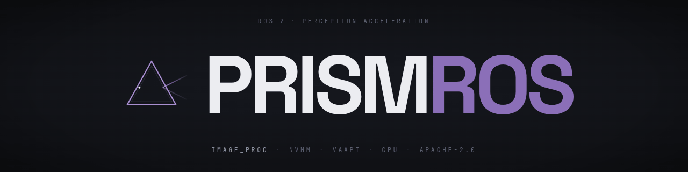

<p align="center">
  
</p>

# Prism

*ROS 2 perception acceleration that picks the right path through your hardware.*

[](LICENSE)
[](https://sohams25.github.io/prism-ros/)
[](https://github.com/sohams25/prism-ros)
[](https://docs.ros.org/en/humble/)
[](https://github.com/sohams25/prism-ros/actions/workflows/ci.yml)

A hardware-agnostic ROS 2 image-processing accelerator. `prism::ResizeNode` is a drop-in replacement for `image_proc::ResizeNode`'s resize pipeline (one-line launch swap, same parameters, scaled `CameraInfo` on the paired topic). At startup it detects and live-validates host accelerators against the GStreamer registry — Jetson NVMM → Intel VA-API → CPU direct mode — with zero-copy intra-process ingest, single-copy egress, and no DDS round-trip on the supported paths.

Prism targets the segment of the ROS 2 fleet Isaac ROS does not cover: Intel iGPU, AMD, Rockchip RK3588 / Mali-G610, older Jetson, and Jetson Orin pinned to Humble.

[**Project Website →**](https://sohams25.github.io/prism-ros/)

---

## Quick start

### Prerequisites

ROS 2 Humble on Ubuntu 22.04. GStreamer 1.20+.

### Install

```bash
cd ~/ros2_ws/src
git clone https://github.com/sohams25/prism-ros.git prism_image_proc

sudo apt install \
    ros-humble-image-transport \
    ros-humble-image-transport-plugins \
    ros-humble-image-proc \
    libgstreamer1.0-dev \
    libgstreamer-plugins-base1.0-dev \
    gstreamer1.0-plugins-base \
    gstreamer1.0-plugins-good \
    gstreamer1.0-vaapi

cd ~/ros2_ws
colcon build --packages-select prism_image_proc
source install/setup.bash
```

### Run the demo

The demo launch file spins up a single `prism::ResizeNode` inside a component container, subscribed to `/camera/image_raw` and publishing to `/camera/image_processed`. Point a camera driver at `/camera/image_raw`, or run `prism::MediaStreamerNode` / `prism::Synthetic4kPubNode` in a second terminal as the source.

```bash
ros2 launch prism_image_proc prism_image_proc_demo.launch.py
```

The resize node logs the selected backend (GPU or direct mode) and publishes processed 640×480 frames on `/camera/image_processed` with scaled `CameraInfo` on the paired topic.

For the side-by-side stress test against `image_proc::ResizeNode`, see [Visual Comparison Demo](#visual-comparison-demo) below.

## Usage

### Drop-in replacement for image_proc::ResizeNode

```python
ComposableNode(
    package='prism_image_proc',           # was: 'image_proc'
    plugin='prism::ResizeNode',           # was: 'image_proc::ResizeNode'
    name='resize',
    parameters=[{'use_scale': False, 'width': 640, 'height': 480}],
)
```

Same resize parameters, same output topic, same `sensor_msgs/Image` on the output. Prism also publishes a scaled `CameraInfo` on the paired topic — toggled by the `publish_camera_info` parameter.

### Action chaining

The chainable base — `prism::ImageProcNode` — accepts a comma- or pipe-separated action chain. Each action has per-backend GStreamer fragment builders (CPU / Intel VA-API / Jetson NVMM) and a corresponding CameraInfo transform so intrinsics track the image.

```python
ComposableNode(
    package='prism_image_proc',
    plugin='prism::ImageProcNode',
    name='preprocess',
    parameters=[{
        'action': 'crop,resize,colorconvert',
        'crop_x': 320, 'crop_y': 180,
        'crop_width': 1280, 'crop_height': 720,
        'width': 640, 'height': 360,
        'target_encoding': 'rgb8',
    }],
)
```

Three thin wrappers ship today (`prism::ResizeNode`, `prism::CropNode`, `prism::ColorConvertNode`); `flip` is supported as an action on the chainable base. Per-action `prism::FlipNode` and extension to additional `image_proc` operations are forward-work — see Roadmap.

### Visual Comparison Demo

`launch/A_B_comparison.launch.py` runs `image_proc::ResizeNode` and `prism::ResizeNode` side-by-side in separate component containers over the same source video, for latency / CPU / RSS comparison.

```bash
ros2 launch prism_image_proc A_B_comparison.launch.py \
    video_path:=/path/to/4k_video.mp4
```

## Components

Registered ROS 2 components:

| Class | Purpose |
| --- | --- |
| `prism::ImageProcNode` | Chainable base. Configurable action chain (`resize`, `crop`, `flip`, `colorconvert`); use directly when you need composed operations. |
| `prism::ResizeNode` | Thin wrapper pinning `action="resize"`. **Drop-in replacement for `image_proc::ResizeNode`'s resize pipeline.** |
| `prism::CropNode` | Thin wrapper pinning `action="crop"`. |
| `prism::ColorConvertNode` | Thin wrapper pinning `action="colorconvert"`. Target `bgr8` / `rgb8` / `mono8`. |

Test / demo helpers:

| Class | Purpose |
| --- | --- |
| `prism::MediaStreamerNode` | Video-file publisher (used by the Visual Comparison Demo). |
| `prism::Synthetic4kPubNode` | Synthetic 4K test source. |

Load any of the above into an `rclcpp_components::ComponentContainer` with `use_intra_process_comms: true` to get the zero-copy ingest path.

## Parameters

<details>
<summary>Expand full parameter reference</summary>

### Core resize

| Parameter | Type | Default | Description |
|---|---|---|---|
| `use_scale` | bool | `false` | Scale by factor instead of absolute size |
| `scale_width`, `scale_height` | double | `1.0` | Scale factors when `use_scale=true` |
| `width`, `height` | int | `640`, `480` | Output size when `use_scale=false` |
| `input_topic` | string | `/camera/image_raw` | Source topic |
| `output_topic` | string | `/camera/image_processed` | Destination topic |

### Action chain

| Parameter | Type | Default | Description |
|---|---|---|---|
| `action` | string | `resize` | Action chain, comma- or pipe-separated (e.g. `crop,resize,colorconvert`) |
| `target_encoding` | string | `bgr8` | Only read when chain contains `colorconvert`. One of `bgr8`, `rgb8`, `mono8` |
| `crop_x`, `crop_y`, `crop_width`, `crop_height` | int | `0` | Only read when chain contains `crop`. Pixel offsets into the source |
| `flip_method` | string | `none` | Only read when chain contains `flip`. `none`, `horizontal`, or `vertical` |

### Transport and CameraInfo

| Parameter | Type | Default | Description |
|---|---|---|---|
| `input_transport` | string | `raw` | `image_transport` name (`raw`, `compressed`, `theora`, …). `raw` keeps the UniquePtr zero-copy hot path |
| `publish_camera_info` | bool | `true` | Publish a scaled `CameraInfo` alongside the processed image |
| `camera_info_input_topic` | string | `""` | Optional override; empty string derives `<image_topic_namespace>/camera_info` per ROS convention |
| `camera_info_output_topic` | string | `""` | Optional override for the published CameraInfo topic |
| `source_width`, `source_height` | int | `3840`, `2160` | Source caps (GPU mode only) |

### Media streamer parameters

`prism::MediaStreamerNode` — video-file publisher used by the Visual Comparison Demo.

| Parameter | Type | Default | Description |
|---|---|---|---|
| `video_path` | string | `/tmp/test_video.mp4` | Input video file |
| `loop` | bool | `true` | Restart on EOF |
| `max_fps` | double | `10.0` | Publish rate cap |
| `image_topic` | string | `/camera/image_raw` | Image topic |
| `info_topic` | string | `/camera/camera_info` | CameraInfo topic |

</details>

## Architecture

At startup `HardwareDetector` probes `/dev` for accelerator devices, then queries the live GStreamer registry via `gst_element_factory_find` (the same C API that `gst-inspect` is built on) to confirm the matching elements load. The Jetson probe is two-step: prefer `nvvideoconvert`, fall back to the legacy `nvvidconv`. The Intel probe is two-step too: prefer `vapostproc`, fall back to `vaapipostproc`. `PipelineFactory` then builds a backend-specific pipeline fragment for each action in the chain, validates the complete pipeline live, and hands it to `ImageProcNode`. If no GPU element registers, the node falls back to a direct `cv::resize` in the subscriber callback — no GStreamer involvement at all.

<!-- Do NOT add %%{init: {'theme': ...}}%% — GitHub's native Mermaid
     renderer auto-adapts to dark/light mode only when no theme is
     forced. Forcing a theme breaks the opposite mode. -->


### Fallback chain

| Priority | Platform | Detection | Processing |
|---|---|---|---|
| 1 | NVIDIA Jetson | `/dev/nvhost-*`, `/dev/nvmap` | GStreamer `nvvideoconvert` (CUDA / NVMM); legacy `nvvidconv` accepted as second-step probe |
| 2 | Intel VA-API | `/dev/dri/renderD*` + `vapostproc` in registry | GStreamer `vapostproc` |
| 3 | CPU (always) | — | Direct `cv::resize` in callback |

The fallback is **live-validated** against the GStreamer plugin registry — an accelerator that's present but broken (for example, the `vaapipostproc` chroma bug on GStreamer 1.20) is skipped, not attempted. Per-action routing within a backend is a hand-coded table from operator A/B measurement, not an autonomous runtime optimiser.

## Benchmarks

A/B captures against stock ROS 2 Humble `image_proc` on two hosts: 4K BGR8 input at 10 Hz, 120 s per operation, two `component_container` processes. Full methodology, per-percentile / CPU / RSS / fps data, and the per-host findings live in [`bench/results/intel_desktop_simple_summary.md`](bench/results/intel_desktop_simple_summary.md) and [`bench/results/orin_simple_summary.md`](bench/results/orin_simple_summary.md).

### Intel desktop, GStreamer 1.20, direct-mode fallback

*Intra-process composition + DDS round-trip elimination, not GPU offload — VAAPI is in fallback mode on this GStreamer 1.20 host.*

| Action          | Prism median (ms) | Stock median (ms) | Δ %      |
| --------------- | ----------------: | ----------------: | -------: |
| `resize`        |              4.55 |             10.77 |  −57.8 % |
| `crop`          |              4.27 |             22.65 |  −81.1 % |
| `colorconvert`  |              2.99 |           2323.65 |        — |
| `chain` (3 ops) |             12.86 |             76.28 |  −83.1 % |

`colorconvert` Δ% omitted — stock baseline is a Python NumPy node that cannot drain 4K BGR8 at 10 Hz (`image_proc` ships no C++ colorconvert). Full per-percentile data, methodology, and the throughput-ceiling explanation in [`bench/results/intel_desktop_simple_summary.md`](bench/results/intel_desktop_simple_summary.md).

### Jetson Orin Nano Super, JetPack 6.2

Per-action backend on legacy `nvvidconv` (`resize`/`chain` GPU, `crop` CPU `videocrop`, `colorconvert` GPU). The BGR-CAPS gap that drives this routing, the Round-3 colorconvert contention finding (bench-harness CPU saturation, not BGR-adapter dominance), and the empirical intra-process verification are documented in the linked summary.

| Action          | Prism median (ms) | Stock median (ms) | Δ %      |
| --------------- | ----------------: | ----------------: | -------: |
| `resize`        |             21.77 | —                 | —        |
| `crop`          |            716.56 |            868.65 |  −17.5 % |
| `colorconvert`  |           1194.61 |          14295.86 |        — |
| `chain` (3 ops) |             17.11 | —                 | —        |

Stock-side `image_proc::ResizeNode` does not publish frames inside this container (an `image_proc` packaging issue, not a Prism finding) — so `resize` and `chain` are Prism-only; `colorconvert` Δ% is omitted for the same structural reason as Intel. Full per-percentile data, the Round-3 contention finding, and a single-process direct-mode 9.27 ms colorconvert reference in [`bench/results/orin_simple_summary.md`](bench/results/orin_simple_summary.md).

### Reproducing

```bash
python3 bench/run.py --operation resize \
    --video /path/to/4k.mp4 \
    --duration 120 --warmup 10 \
    --output-dir bench/results/

python3 bench/analyze.py \
    --results-dir bench/results/ \
    --output bench/results/summary.json

python3 bench/emit_simple_summary.py \
    --summary bench/results/summary.json \
    --host-label "<host description>" \
    --gst-version "$(gst-launch-1.0 --version | head -1)" \
    --out bench/results/<host>_simple_summary.md
```

Repeat with `--operation {crop,colorconvert,chain}`.

## Contributing & Roadmap

See [CONTRIBUTING.md](CONTRIBUTING.md). CI runs the gtest suite on every push and pull request via [`.github/workflows/ci.yml`](.github/workflows/ci.yml); release history in [CHANGELOG.md](CHANGELOG.md).

Forward-looking work, from short-term to exploratory:

- **Extend wrapper coverage to additional `image_proc` operations** — per-action `prism::FlipNode` first, then rectify and debayer.
- **GStreamer 1.22+ Intel VA-API capture** to exit direct-mode fallback and exercise the `vapostproc` GPU resize kernel.
- **Jetson Orin capture against an image that ships `nvvideoconvert`** — closes the legacy-`nvvidconv` BGR-CAPS gap.
- **Rockchip RK3588 / Qualcomm QCS 6490 backend exploration** (RubikPi 3 hardware on hand; AMD Ryzen capture and ROS Buildfarm submission queued behind these).
- **Extended test coverage** — integration tests beyond the current gtest unit suite, alongside the Buildfarm submission noted above.

## License

Apache-2.0. See [LICENSE](LICENSE).

---

<details>
<summary><strong>Positioning / Scope</strong> — Isaac ROS coverage gap, the REP-2007/2009 architectural tradeoff, and the segment evidence inside.</summary>

**Segment definition.** Prism targets the segment of the ROS 2 fleet Isaac ROS does not cover: Intel iGPU, AMD, Rockchip RK3588 / Mali-G610, older Jetson, and Jetson Orin pinned to Humble. There is no claim of optimised RK3588 support; that path uses the `cv::resize` fallback today, the same as any non-NVIDIA host without VAAPI.

**Isaac ROS landscape.** Isaac ROS 4.0 (November 2025) pivoted to ROS 2 Jazzy on Jetson Thor, x86 Ampere-or-newer, and DGX Spark; the current branch `release-4.3` continues that line. Isaac ROS 3.2 is the last branch supporting Jetson Orin Nano/NX/AGX and Xavier on Humble. There is no non-NVIDIA support in any branch.

**REP-2007/2009 as architectural choice.** Prism does not implement REP-2007 type adaptation or REP-2009 type negotiation. Type adaptation couples the data path to one vendor's buffer types. Runtime backend selection with live GStreamer-registry validation is the alternative. The tradeoff is deliberate: hardware portability across Intel, AMD, RK3588, and Orin-on-Humble in exchange for giving up GPU-resident data flow between nodes.

</details>
